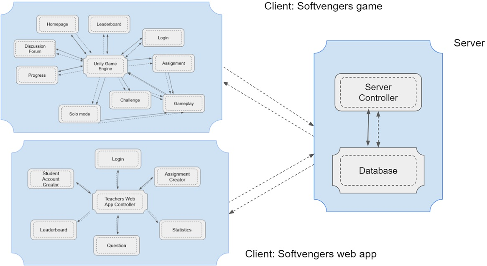

# Softvengers

Demo: https://www.youtube.com/watch?v=6tREMOZixZc

## About

Softvengers is a social game to gamify and socialize teaching and learning of software
engineering courses. In the version 1.0 of the product, students can learn and compete with each other via playing the
game, and teachers can assess the mastery of course via data analysis

## Product Scope

The software will allow the students to augment their learning in the classroom of software engineering courses by gamifying the concepts taught. Thus, students can learn and compete with each other via playing the game, and teachers can assess the mastery of the course via data analysis.

The software will benefit the students by increasing their learning interests and interactions. They can learn while being engaged for getting higher ranks in the leaderboard. They will challenge each other by designing their own sections.

The software will benefit the teachers by releasing their burden from manual teaching activities. They will easily
assess the mastery of course via data analysis (realtime and continuously) besides automatically performing
assignment grading. It would also allow them to logically adjust the teaching contents and key points.

The software thus aims to achieve the goal of stimulating learning interests of the students by involving them in a
continuous and interactive activity after class, while the teachers keep a track of the performance of the students

## Product Functionalities

1. Teachers will be able to use this product to share assignments with students, monitor their progress and
upload questions for testing the students.
2. Teachers can gain useful insights from the statistics of the student’s performance.
3. Students will be able to test their understanding of software engineering by answering questions while they
explore the universe. In this process they will collect badges and points which will boost their confidence and
further motivate them.
4. Students will be able to create and challenge peers on social media.
5. Students can also attempt assignments.
6. Students can make posts on the discussion forum.
7. Both teachers and students can view the leaderboard to compare performance among all tutorial groups.

## Architecture Diagram

## Software Requirements Specifications

For more information please refer to [SRS.pdf](docs/SRS.pdf) and [Presentation](docs/presentation.pdf)